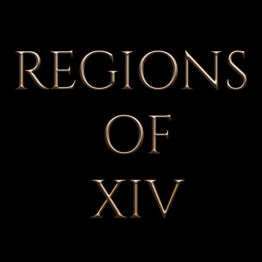

<div align="center">



# Regions of XIV

**Announces the region, zone, area and sub-area you walk into,
with a styled, animated on-screen notification.**

[](https://github.com/Yesanith/RegionsOfXIV/releases/latest)
[](https://github.com/Yesanith/RegionsOfXIV/actions/workflows/pr-build.yml)
[](LICENSE.md)

</div>

Final Fantasy XIV announces zone changes on screen, but changes your **sub-area**
silently, and the only feedback is the small text above the minimap. Regions of XIV
surfaces those transitions, and lets you restyle zone announcements to taste.

Inspired by [Nekres' *Regions of Tyria*](https://blishhud.com/modules/?module=Nekres.Regions_Of_Tyria)
for Guild Wars 2.

## Features

- **Four tiers, not one.** Region, zone, area and sub-area, each announced as it
  changes, including the sub-area changes the game never announces at all.
- **Replaces rather than stacks.** Hides the game's own area flash and
  loading-screen title and draws in their place, so an arrival reads as one
  notice instead of two. Both are a checkbox away from coming back.
- **Weather, if you want it.** The sky above the place name, with the game's own
  icon beside it, as you arrive and again whenever it turns over. Worked out from
  the clock rather than read off the screen, so it is there the moment you land.
- **The game's banners, in your lettering.** Quest Accepted, Duty Commenced,
  Level Up! and the rest, redrawn with the same effects as a place name. A
  banner's wording is painted into its artwork rather than stored as text, so the
  names are transcribed by hand and only English is substantially covered. A
  banner the plugin has no name for keeps the game's own.
- **Decodes from the Eorzean alphabet** as it reveals, glyph by glyph, and the
  letters can rise, wave, type or catch alight while they resolve.
- **Hearts, embers, sparkles or petals** drifting around the text, if that is
  your sort of thing. Drawn from primitives, so they cost no download and work
  under every font.
- **Presets to start from.** Inferno, Sweetheart, Starlight, Sakura, Dispatch,
  Tyria: each one a motion, a particle and a palette that suit each other.
  Every setting stays yours to change afterwards.
- **Correct in every language.** Names come from game data rather than from the
  screen, and the default font carries glyphs for every language the client can
  display.
- **Your own fonts.** Name, header and weather each pick their own face and
  size: one of the game's own, Dalamud's Noto, or any `.ttf`, `.otf` or `.ttc`
  sitting on your PC. A font you supply loads exactly as it is and stays yours to
  look after, and a preset carries where the file sits rather than the font
  itself, so a shared one falls back to Noto on someone else's machine. It has to
  carry the letters your client needs: the plugin asks for Latin, kana and kanji,
  but it cannot add a glyph a font does not have, so a Latin-only display face on
  the Japanese client will draw blanks for Japanese place names.
- **Styled to taste.** Place it anywhere on screen, with your own colours, letter
  spacing, casing, outline weight and a drop shadow you can throw in any
  direction. Name, header and weather can each take their own colour and outline,
  or share one.
- **Live preview.** Drag the position, size and colour sliders and a sample
  notification follows them as you go.
- **Knows when to stay quiet.** Silent through cutscenes, PvP and gpose; through
  combat and duties if you ask; and it skips sub-areas while you are flying, so
  crossing a zone at speed does not announce a string of places you passed over.

## Installing

> Regions of XIV is distributed through the custom repository below. Add it once
> and the plugin installs and updates itself like any other.

In game: `/xlsettings` → **Experimental** → paste into **Custom Plugin
Repositories**:

```
https://raw.githubusercontent.com/Yesanith/DalamudPlugins/main/repo.json
```

Tick **Enabled**, click **+**, then **Save and Close**. Open `/xlplugins` →
**All Plugins**, search for **Regions of XIV**, and install.

Then `/regions` opens the settings.

<details>
<summary>Or install it by hand</summary>

1. Download `latest.zip` from the
   [latest release](https://github.com/Yesanith/RegionsOfXIV/releases/latest).
2. Unzip it somewhere permanent.
3. In Dalamud settings, add that folder to **Dev Plugin Locations**, then enable
   the plugin.

This does not auto-update. Building from source works the same way. See
[Building](#building).

</details>

## Usage

| Command | Effect |
| --- | --- |
| `/regions` | open the settings |
| `/regions test` | fire a sample notification, bypassing the suppression rules |
| `/regions changelog` | show what has changed, all versions |

The settings open by themselves the first time, because the defaults change what
the game itself draws.

## Building

Requires the **.NET 10 SDK (10.0.101 or later)** and a XIVLauncher install that has
run Dalamud at least once.

```sh
dotnet build RegionsOfXIV.sln -c Release
```

Two things come out of that, and they are easy to mix up:

| Path | What it is |
| --- | --- |
| `src/RegionsOfXIV/bin/x64/Release/` | the plugin itself: DLL, `Fonts/`, `images/`. Point Dalamud's **Dev Plugin Locations** here |
| `src/RegionsOfXIV/bin/x64/Release/RegionsOfXIV/` | the packaged layout: `latest.zip`, manifest and icon, for the repository listing. No DLL, so dev-loading from here finds nothing |

The tests need neither the game nor Dalamud, so they run anywhere the SDK does:

```sh
dotnet test RegionsOfXIV.sln -c Release
```

### Developer tools

Four files are compiled only in Debug, which is what Rider and Visual Studio
build by default:

| File | What it does |
| --- | --- |
| `Services/SheetSearch.cs` | searches the game's Excel sheets, writing what it finds to the Dalamud log |
| `UI/IconBrowserWindow.cs` | a scrollable grid of the game's own icons, for finding an icon ID |
| `UI/BannerPreviewWindow.cs` | fires any banner on demand, and is where banner names get transcribed |
| `Services/SoundSweep.cs` | plays the game's chat sound effects, one by number or all of them in turn |

They are wired to five `/regions` subcommands that exist only in a Debug build:

| Command | Effect |
| --- | --- |
| `/regions preview` | open the banner preview |
| `/regions icons` | open the icon browser |
| `/regions banners` | log the banner rows found in the sheets |
| `/regions find <term>` | search the sheets for a term and log the hits |
| `/regions sound [n]` | play chat sound effect `n`, or sweep through all of them |

The first three are removed from compilation by `RegionsOfXIV.csproj` in every
configuration but Debug. `SoundSweep.cs` wraps its own contents in `#if DEBUG`
instead, which reaches the same end by another route, and the code that wires
all four up is guarded the same way in `Plugin.cs`, `CommandRouter.cs` and
`NotificationSounds.cs`. Either way the types are absent from the Release
assembly entirely, not merely unreachable.

### Translating the settings window

Interface strings live in `src/RegionsOfXIV/Localization/`, one JSON file per
language code, such as `de.json`, or `pt-BR.json` for a regional one. They are embedded
by a glob and discovered from the resource names, so **a new language is a file,
not a code change**. German, French and Japanese ship as machine drafts; every
one of them wants a speaker's eye.

#### `en.json` is generated

`en.json` is the translators' copy and is never read at runtime. The English the
plugin shows is compiled into the call sites (`Loc.Get(key, english)`), so a
missing key, a blank entry or a file that will not parse falls back to English
rather than showing anything broken. That also means the two can drift, so the
file is generated rather than edited:

```
python tools/export-en-json.py            rewrite it from the call sites
python tools/export-en-json.py --check    report drift, change nothing
```

The generator carries the `description` fields over untouched, along with the
order keys appear in and the blank lines between groups, so regenerating a file
nothing has changed in produces no diff at all.

#### The descriptions are the point

Every entry carries a `description`. It is not documentation. It is the note a
translator works from, and it is where the traps are recorded: which words are
identifiers, which are FFXIV's own terms, which line breaks matter, which
placeholders must survive. Write one for every new key. Some worth reading
before starting: `announcements.subarea`, `announcements.hideduty`,
`appearance.uppercase` and `announcements.banners.tooltip`.

Four rules that the descriptions repeat, because breaking them is invisible
until someone hits it:

- **Placeholders survive.** `{0}`, `{1}`, and `{0:F0}` with its format intact. A
  mangled one falls back to the English sentence and the work is wasted silently.
- **FFXIV's own terms win.** Duty, aetheryte, sanctuary, the Eorzean script, the
  banner wording. The game already translates these. Use its words, or leave
  the entry out and say so, rather than coining new ones.
- **Identifiers are never translated.** `_AreaText`, `_LocationTitle`, `ROX1-`,
  `/regions test`, typeface names, product names.
- **A key you leave out stays English.** That is the intended way to say "not
  yet", and it reads as partly English rather than as a hole.

A file may carry `_status` and `_untranslated` keys. The loader ignores anything
beginning with an underscore, except `_status`: a file whose status says
`machine-drafted` makes the settings window show a dismissible notice saying so,
which is how a rough translation stops pretending to be finished. Take the
marker out once the file has been through a speaker, and the notice stops.

#### What the window can draw

The window draws with the game's own AXIS font, which carries Latin-1, the
Russian Cyrillic alphabet, kana and around 6,300 kanji, but only eight
characters of Latin Extended-A. `UI/WindowFont.cs` therefore merges the Windows
interface font in behind it for Latin Extended-A, Latin Extended-B and Latin
Extended Additional, so **Turkish, Polish, Czech, Romanian and Vietnamese all
draw**. Basic Latin still comes from AXIS, because the first font to claim a code
point wins the merge, so those languages render in two typefaces at once. Uneven,
and a great deal better than blank boxes.

Still out of reach: **non-Russian Cyrillic, Hebrew, Arabic, Thai, Korean and
Chinese**, since the merge is Latin only. Glyph ranges are fixed when the atlas
is built, so nothing recovers them at run time. The loader warns to the log when
a language file uses characters the window cannot draw, and
`NoBundledLanguageNeedsGlyphsTheWindowLacks` fails the build before one can
ship.

### How it fits together

`Services/AnnouncementCoordinator.cs` is the brain: everything that decides *what*
gets announced and *when* lives there, and it is where to start reading.

It never touches the game directly. Everything it listens to arrives through a
small interface (arrivals, movement, weather, banners, the game's own area text,
and the two name lookups) bundled as `AnnouncementSources`. `Plugin.cs` is the
only place that knows which real implementation goes with which, and the tests
hand it fakes instead. That is why the announcement rules can be exercised without
launching the game.

| Layer | What lives there |
| --- | --- |
| `Services/` | detection, decisions, game data. Never draws, never references `UI` |
| `UI/` | windows, the overlay, and the glyph painting |
| `Models/` | the few plain records both sides pass around |

The plugin draws its own text glyph by glyph rather than handing ImGui a string,
because the effects animate each letter separately. `UI/NotificationRenderer.cs`
decides where a line goes; `UI/NotificationRenderer.Runs.cs` paints it.

`Services/FontService.cs` keeps one face per `FontRole` (text, header, weather)
and rebuilds only the roles whose face, size or file actually changed. A role
set to a custom file also holds a Noto fallback, so a font that will not load
degrades to something readable rather than to nothing.

## Feedback

Issues and suggestions are welcome on the
[issue tracker](https://github.com/Yesanith/RegionsOfXIV/issues).

## License

AGPL-3.0-or-later. See [LICENSE.md](LICENSE.md).

The licence covers this project's own source. It does **not** extend to third-party
material the plugin uses or references. See [NOTICE](NOTICE).
