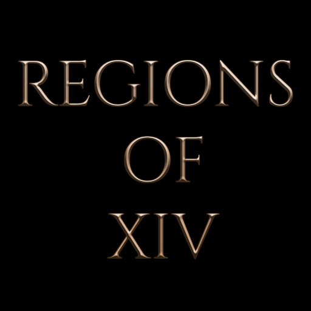
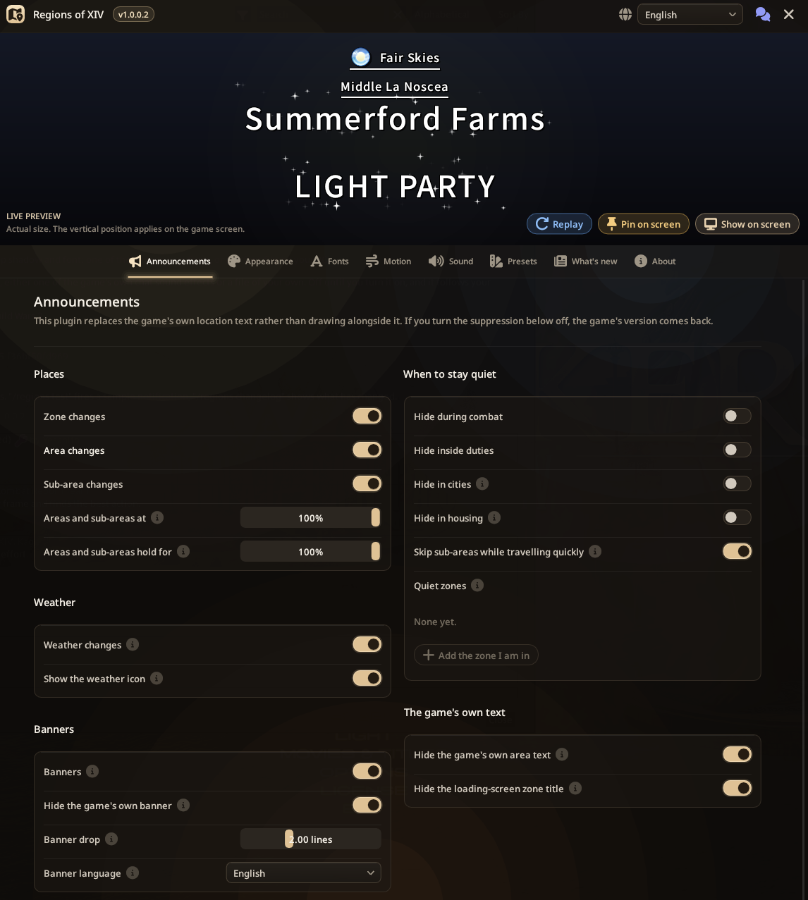
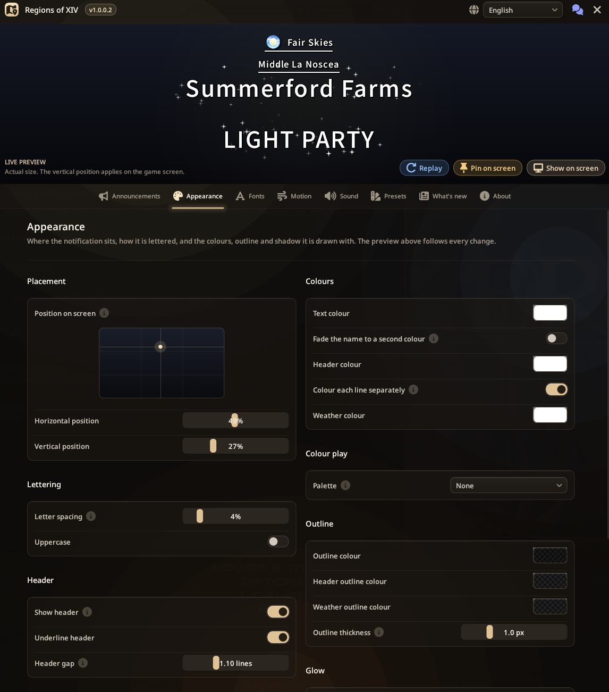
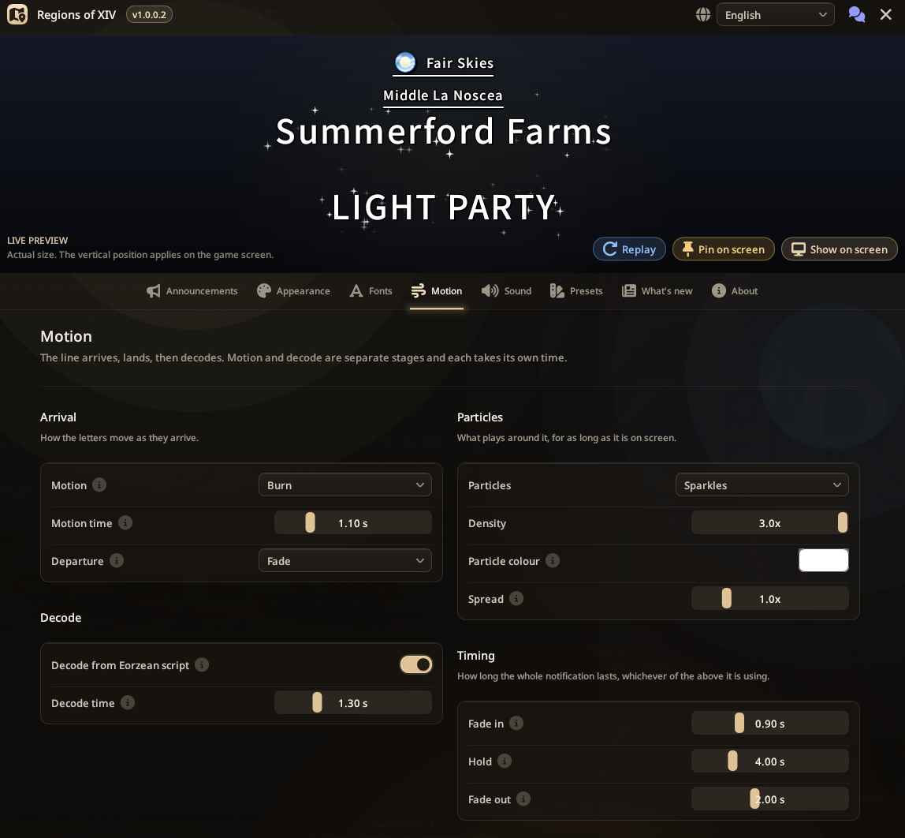
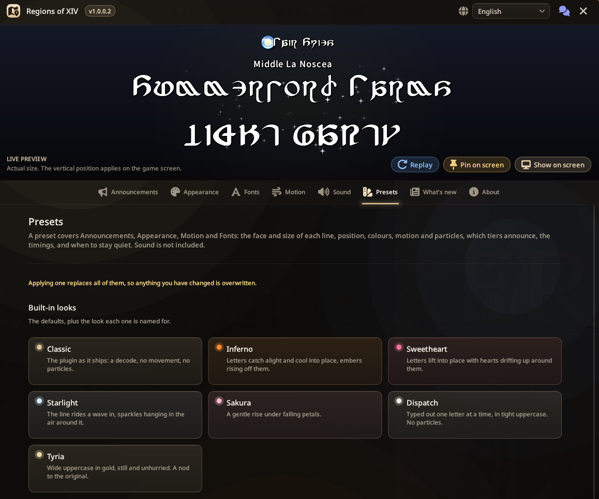

<div align="center">



# Regions of XIV

**Announces the region, zone, area and sub-area you walk into,
with a styled, animated on-screen notification.**

[](https://github.com/Yesanith/RegionsOfXIV/releases/latest)
[](https://github.com/Yesanith/RegionsOfXIV/actions/workflows/pr-build.yml)
[](LICENSE.md)
[](https://discord.com/invite/ax2gsRqvpa)
[](https://buymeacoffee.com/yesanith)

</div>

Final Fantasy XIV announces zone changes on screen, but changes your **sub-area**
silently, and the only feedback is the small text above the minimap. Regions of XIV
surfaces those transitions, and lets you restyle zone announcements to taste.

Inspired by [Nekres' *Regions of Tyria*](https://blishhud.com/modules/?module=Nekres.Regions_Of_Tyria)
for Guild Wars 2.

<div align="center">



<sub>Everything is set up in one window, with the notification drawn at actual size above it.</sub>

</div>

## Features

### What it announces

- **Four tiers, not one.** Region, zone, area and sub-area, each announced as it
  changes, including the sub-area changes the game never announces at all.
- **Replaces rather than stacks.** Hides the game's own area flash and
  loading-screen title and draws in their place, so an arrival reads as one
  notice instead of two. Both are a checkbox away from coming back.
- **Weather, if you want it.** The sky above the place name, with the game's own
  icon beside it, as you arrive and again whenever it turns over. Worked out from
  the clock rather than read off the screen, so it is there the moment you land.
- **The game's banners, in your lettering.** Quest Accepted, Duty Commenced,
  Level Up! and the rest, redrawn with the same effects as a place name.
- **Correct in every language.** Names come from game data rather than from the
  screen, and the default font carries glyphs for every language the client can
  display.

### How it looks

- **Decodes from the Eorzean alphabet** as it reveals, glyph by glyph. The letters
  can rise, drop, slide, assemble, flicker, zoom, wave, type or catch alight while
  they resolve, and a line can leave the way it came, dissolve or sink rather than
  only fading.
- **Hearts, embers, sparkles, petals, snow, fireflies, leaves, rain or stars**
  drifting around the text, as close to the name or as far around it as you like.
  Drawn from primitives, so they cost no download and work under every font.
- **Styled to taste.** Place it anywhere on screen, with your own colours, letter
  spacing, casing, outline weight, a glow, and a drop shadow thrown in any
  direction. Name, header and weather can each take their own colour and outline,
  or share one. The name can fade to a second colour, or be lettered in a run of
  colours that lies across the line, travels along it or cycles through it. A dark
  band behind the text, or a strip across the screen, for names that land on a
  bright sky.
- **Your own fonts.** Name, header and weather each pick their own face and size:
  one of the game's own, Dalamud's Noto, or any `.ttf`, `.otf` or `.ttc` on your PC.
- **Presets to start from.** Inferno, Sweetheart, Starlight, Sakura, Dispatch and
  Tyria, each a motion, a particle and a palette that suit each other. Every
  setting stays yours to change afterwards, and presets travel as share codes.
- **Live preview.** The settings window paints the notification at actual size,
  motion and all, and follows every change as you make it. Hover a preset and the
  preview shows that instead.

### Staying out of the way

- **Knows when to stay quiet.** Silent through cutscenes, PvP and gpose; through
  combat, duties, cities and housing if you ask; in any zone you put on its quiet
  list; and it skips sub-areas while you are flying, so crossing a zone at speed
  does not announce a string of places you passed over.
- **Smaller places can whisper.** An area or sub-area notice can be a fraction of
  the size and the hold of a zone arrival, so the frequent tiers stop shouting.
- **A sound, if you want one.** One of the game's own chat effects, with weather
  and banners able to take one of their own, or a `.wav` or `.mp3` of yours at a
  volume you choose. Off until you ask for it, and it follows the game's own volume
  and mute settings, so it goes quiet when the game does.

<details>
<summary><b>Two limits worth knowing before you set it up</b></summary>

<br>

**Banner wording is only substantially covered in English.** A banner's text is
painted into its artwork rather than stored as text, so the names are transcribed
by hand. A banner the plugin has no name for keeps the game's own.

**A font you supply has to carry the letters your client needs.** The plugin asks
for Latin, kana and kanji, but it cannot add a glyph a font does not have, so a
Latin-only display face on the Japanese client will draw blanks for Japanese place
names. A font you supply loads exactly as it is and stays yours to look after, and
a preset carries where the file sits rather than the font itself, so a shared
preset falls back to Noto on someone else's machine.

</details>

## A look around

<div align="center">

| | | |
| :---: | :---: | :---: |
|  |  |  |
| **Appearance** | **Motion** | **Presets** |
| Placement, lettering, colours, outline, glow and shadow | Arrival, decode, particles, and how long each stage takes | Six looks to start from, each one a motion, a particle and a palette |

<sub>The preview in the Presets shot is caught partway through, still in the Eorzean
script the name resolves out of.</sub>

</div>

## Installing

> Regions of XIV is distributed through the custom repository below. Add it once
> and the plugin installs and updates itself like any other.

In game: `/xlsettings` → **Experimental** → paste into **Custom Plugin
Repositories**:

```
https://raw.githubusercontent.com/Yesanith/DalamudPlugins/main/repo.json
```

Tick **Enabled**, click **+**, then **Save and Close**. Open `/xlplugins` →
**All Plugins**, search for **Regions of XIV**, and install.

Then `/regions` opens the settings.

<details>
<summary>Or install it by hand</summary>

<br>

1. Download `latest.zip` from the
   [latest release](https://github.com/Yesanith/RegionsOfXIV/releases/latest).
2. Unzip it somewhere permanent.
3. In Dalamud settings, add that folder to **Dev Plugin Locations**, then enable
   the plugin.

This does not auto-update. Building from source works the same way. See
[Building](#building).

</details>

## Usage

| Command | Effect |
| --- | --- |
| `/regions` | open the settings |
| `/regions test` | fire a sample notification, bypassing the suppression rules |
| `/regions changelog` | show what has changed, all versions |

The settings open by themselves the first time, because the defaults change what
the game itself draws.

## Getting help, and helping out

- **[Discord](https://discord.com/invite/ax2gsRqvpa)** for ideas, questions and
  sharing preset codes.
- **[Issue tracker](https://github.com/Yesanith/RegionsOfXIV/issues)** for anything
  wrong or anything missing.
- **[Buy Me a Coffee](https://buymeacoffee.com/yesanith)** if you would like to,
  though nothing in the plugin is behind it.

### Translating the settings window

Interface strings live in `src/RegionsOfXIV/Localization/`, one JSON file per
language code, such as `de.json`, or `pt-BR.json` for a regional one. They are
embedded by a glob and discovered from the resource names, so **a new language is
a file, not a code change**. German, French, Japanese, Turkish, Spanish,
Portuguese, Russian and Chinese ship, all eight complete, and all eight still
marked machine drafts until a speaker has been through them.

**[TRANSLATING.md](TRANSLATING.md) is the guide.** It is written for a translator
rather than for a developer: what a line looks like, why `en.json` is generated
from the call sites rather than edited, what the `description` on every entry is
for, and which scripts the settings window can actually draw.

Two things in there are the code's problem rather than a translator's.
`UI/Fonts.cs` draws the window with a bundled Latin subset of Noto Sans, which
carries Latin Extended in full, and merges Dalamud's Noto Sans CJK in behind it
for Greek, Cyrillic, kana and kanji, which is what lets Turkish, Polish, Czech,
Romanian, Vietnamese and Japanese render. And
`NoBundledLanguageNeedsGlyphsTheWindowLacks` fails the build before a language
the window cannot draw can ship.

## Building

Requires the **.NET 10 SDK (10.0.101 or later)** and a XIVLauncher install that has
run Dalamud at least once.

```sh
dotnet build RegionsOfXIV.sln -c Release
dotnet test  RegionsOfXIV.sln -c Release
```

The tests need neither the game nor Dalamud, so they run anywhere the SDK does.

Two things come out of a build, and they are easy to mix up:

| Path | What it is |
| --- | --- |
| `src/RegionsOfXIV/bin/x64/Release/` | the plugin itself: DLL, `Fonts/`, `images/`. Point Dalamud's **Dev Plugin Locations** here |
| `src/RegionsOfXIV/bin/x64/Release/RegionsOfXIV/` | the packaged layout: `latest.zip`, manifest and icon, for the repository listing. No DLL, so dev-loading from here finds nothing |

<details>
<summary><b>Developer tools</b></summary>

<br>

Four files are compiled only in Debug, which is what Rider and Visual Studio
build by default:

| File | What it does |
| --- | --- |
| `Services/SheetSearch.cs` | searches the game's Excel sheets, writing what it finds to the Dalamud log |
| `UI/IconBrowserWindow.cs` | a scrollable grid of the game's own icons, for finding an icon ID |
| `UI/BannerPreviewWindow.cs` | fires any banner on demand, and is where banner names get transcribed |
| `Services/SoundSweep.cs` | plays the game's chat sound effects, one by number or all of them in turn |

They are wired to five `/regions` subcommands that exist only in a Debug build:

| Command | Effect |
| --- | --- |
| `/regions preview` | open the banner preview |
| `/regions icons` | open the icon browser |
| `/regions banners` | log the banner rows found in the sheets |
| `/regions find <term>` | search the sheets for a term and log the hits |
| `/regions sound [n]` | play chat sound effect `n`, or sweep through all of them |

The first three are removed from compilation by `RegionsOfXIV.csproj` in every
configuration but Debug. `SoundSweep.cs` wraps its own contents in `#if DEBUG`
instead, which reaches the same end by another route, and the code that wires
all four up is guarded the same way in `Plugin.cs`, `CommandRouter.cs` and
`NotificationSounds.cs`. Either way the types are absent from the Release
assembly entirely, not merely unreachable.

</details>

<details>
<summary><b>How it fits together</b></summary>

<br>

`Services/AnnouncementCoordinator.cs` is the brain: everything that decides *what*
gets announced and *when* lives there, and it is where to start reading.

It never touches the game directly. Everything it listens to arrives through a
small interface (arrivals, movement, weather, banners, the game's own area text,
and the two name lookups) bundled as `AnnouncementSources`. `Plugin.cs` is the
only place that knows which real implementation goes with which, and the tests
hand it fakes instead. That is why the announcement rules can be exercised without
launching the game.

| Layer | What lives there |
| --- | --- |
| `Services/` | detection, decisions, game data. Never draws, never references `UI` |
| `UI/` | the settings window and its pages, the overlay, and the glyph painting. `UI/Components/` is the widget set the window is built from, `UI/Shell/` its header and backdrop |
| `Models/` | the few plain records both sides pass around |

The plugin draws its own text glyph by glyph rather than handing ImGui a string,
because the effects animate each letter separately. `UI/NotificationRenderer.cs`
decides where a line goes; `UI/NotificationRenderer.Runs.cs` paints it.

`Services/FontService.cs` keeps one face per `FontRole` (text, header, weather)
and rebuilds only the roles whose face, size or file actually changed. A role
set to a custom file also holds a Noto fallback, so a font that will not load
degrades to something readable rather than to nothing.

The settings window has fonts of its own, in `UI/Fonts.cs`: caption, body,
headline and title tiers, plus three sizes of icon, every one a ratio of the
font size chosen in Dalamud's settings rather than a pixel count. The window is
drawn through the draw list rather than through stock ImGui widgets, so every
control in `UI/Components/` takes an explicit id and its wording through
`Loc.Get`; nothing in it depends on a label to keep its identity.

The preview stage under the window's header is `UI/PreviewStage.cs`: the same
`NotificationRenderer` the overlay uses, handed a `Canvas` that is the stage
rather than the screen, painting pinned notifications that never fade. It is
why every colour, font and motion setting can be seen without leaving the
window; the position sliders and the pin button are what the game screen is
still for.

</details>

## License

AGPL-3.0-or-later. See [LICENSE.md](LICENSE.md).

The licence covers this project's own source. It does **not** extend to third-party
material the plugin uses or references. See [NOTICE](NOTICE).
